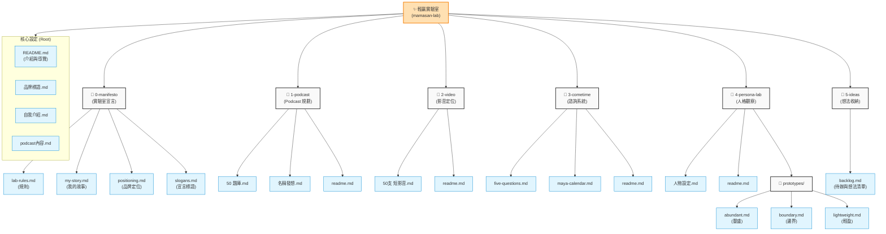

# 輕贏實驗室 (Light Win Lab) 架構圖

這是一份使用 Mermaid 語法繪製的專案架構圖。您可以在 VS Code 等編輯器中，點擊右上角的「開啟預覽 (Open Preview)」按鈕，或是使用快捷鍵 `Ctrl + Shift + V` 來檢視這張圖表。

```mermaid
graph TD
    Root["✨ 輕贏實驗室<br>(mamasan-lab)"]

    %% Root Files
    subgraph core["核心設定 (Root)"]
        README["README.md<br>(介紹與導覽)"]
        Brand["品牌標語.md"]
        Intro["自我介紹.md"]
        PodcastIdea["podcast內容.md"]
    end

    %% Subdirectories
    Dir0["📁 0-manifesto<br>(實驗室宣言)"]
    Dir1["📁 1-podcast<br>(Podcast 規劃)"]
    Dir2["📁 2-video<br>(影音定位)"]
    Dir3["📁 3-cometime<br>(諮詢系統)"]
    Dir4["📁 4-persona-lab<br>(人格觀察)"]
    Dir5["📁 5-ideas<br>(想法收納)"]

    %% Links from Root
    Root --> core
    Root --> Dir0
    Root --> Dir1
    Root --> Dir2
    Root --> Dir3
    Root --> Dir4
    Root --> Dir5

    %% 0-manifesto
    Dir0 --> M1["lab-rules.md<br>(規則)"]
    Dir0 --> M2["my-story.md<br>(我的故事)"]
    Dir0 --> M3["positioning.md<br>(品牌定位)"]
    Dir0 --> M4["slogans.md<br>(宣言標語)"]

    %% 1-podcast
    Dir1 --> P1["50 題庫.md"]
    Dir1 --> P2["名稱發想.md"]
    Dir1 --> P3["readme.md"]

    %% 2-video
    Dir2 --> V1["50支 短影音.md"]
    Dir2 --> V2["readme.md"]

    %% 3-cometime
    Dir3 --> C1["five-questions.md"]
    Dir3 --> C2["maya-calendar.md"]
    Dir3 --> C3["readme.md"]

    %% 4-persona-lab
    Dir4 --> PL1["人物設定.md"]
    Dir4 --> PL2["readme.md"]
    Dir4 --> PL3["📂 prototypes/"]
    
    PL3 --> PL3a["abundant.md<br>(豐盛)"]
    PL3 --> PL3b["boundary.md<br>(邊界)"]
    PL3 --> PL3c["lightweight.md<br>(輕盈)"]

    %% 5-ideas
    Dir5 --> I1["backlog.md<br>(待辦與想法清單)"]

    %% Styling
    classDef folder fill:#f9f9f9,stroke:#333,stroke-width:2px;
    classDef file fill:#e1f5fe,stroke:#0288d1,stroke-width:1px;
    classDef root fill:#ffe0b2,stroke:#f57c00,stroke-width:2px;
    
    class Root root;
    class Dir0,Dir1,Dir2,Dir3,Dir4,Dir5,PL3 folder;
    class README,Brand,Intro,PodcastIdea,M1,M2,M3,M4,P1,P2,P3,V1,V2,C1,C2,C3,PL1,PL2,PL3a,PL3b,PL3c,I1 file;
```
